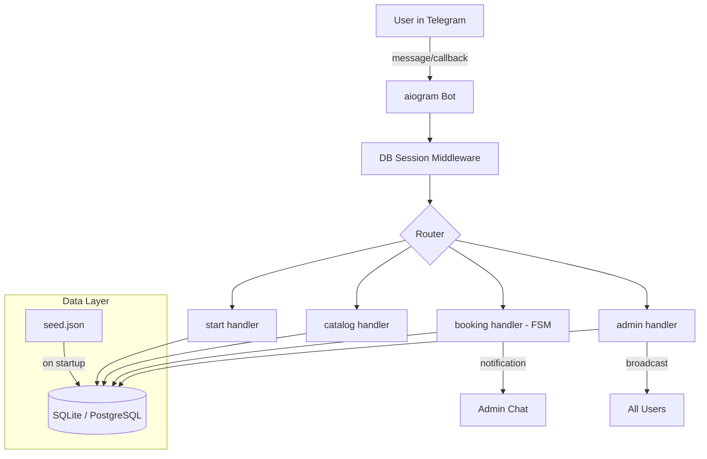

# Architecture

## Components

**Handlers** - aiogram routers, each responsible for a feature (menu, catalog, booking, admin).

**FSM** - Finite State Machine for multi-step booking form. States: service -> name -> phone -> date -> confirm.

**Middleware** - injects async SQLAlchemy session into every handler via `data["session"]`.

**Repositories** - async CRUD functions. No ORM queries in handlers.

**Services** - business logic (phone validation, notification formatting, catalog seeding).
